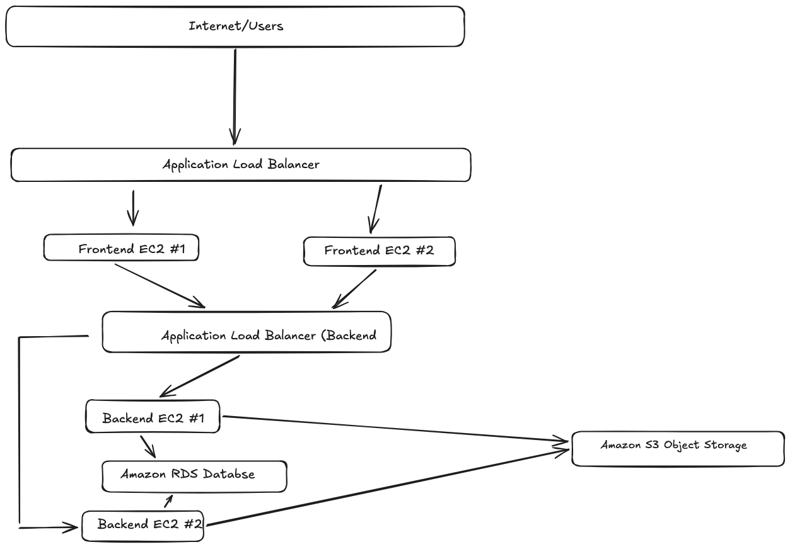

# Basic Cloud Architecture

## Project Overview

This project demonstrates a basic cloud infrastructure design for a web application using AWS services. The architecture is designed to provide scalability, high availability, and redundancy.

## Architecture Diagram

## Architecture Components

- Application Load Balancer – Distributes incoming user traffic across multiple frontend servers.
- Frontend EC2 Instances – Two EC2 instances handle frontend web traffic and provide redundancy.
- Backend Load Balancer – Distributes requests from the frontend layer across the backend servers.
- Backend EC2 Instances – Two EC2 instances process application logic and communicate with the database and storage layer.
- Amazon RDS – Provides a managed relational database for application data.
- Amazon S3 – Provides scalable object storage for files and other application objects.

## Scaling and High Availability

The frontend and backend EC2 instances use horizontal scaling. Multiple instances allow traffic to be distributed across servers and reduce reliance on a single server.

Load balancers distribute traffic between the EC2 instances, improving availability and allowing additional instances to be added as traffic increases.

Amazon RDS provides the database layer, while Amazon S3 provides durable and scalable object storage.

## Traffic Flow

Internet/Users → Application Load Balancer → Frontend EC2 Instances → Backend Load Balancer → Backend EC2 Instances → Amazon RDS / Amazon S3

